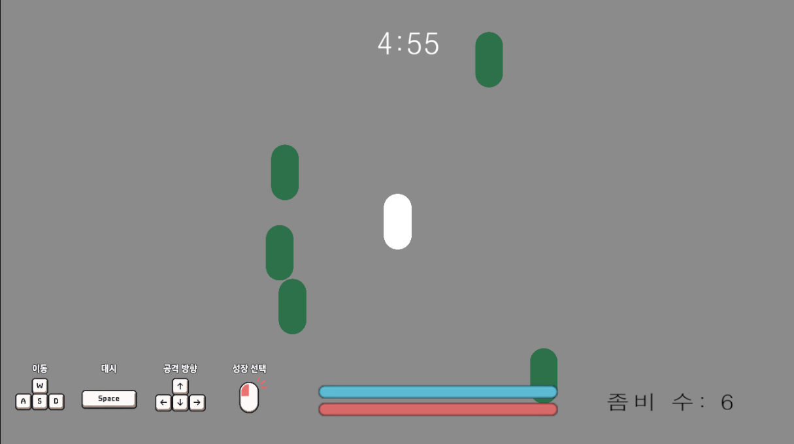
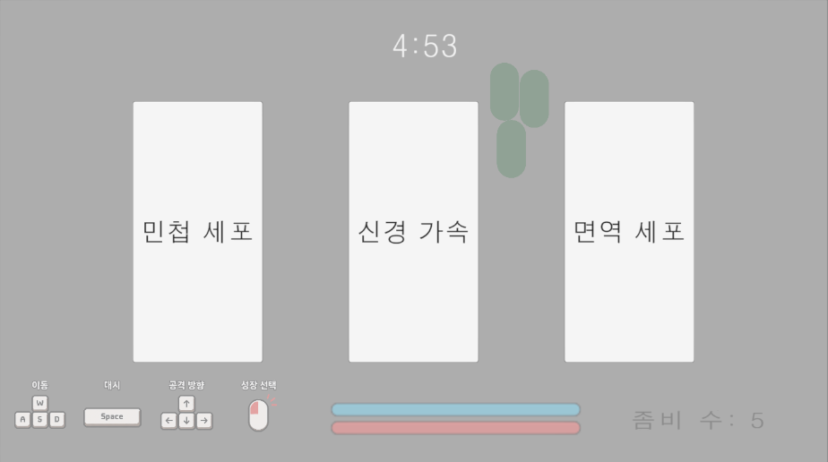
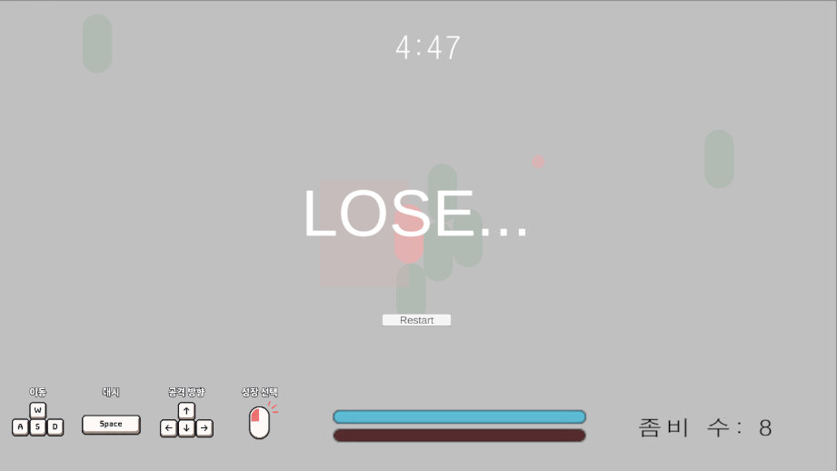
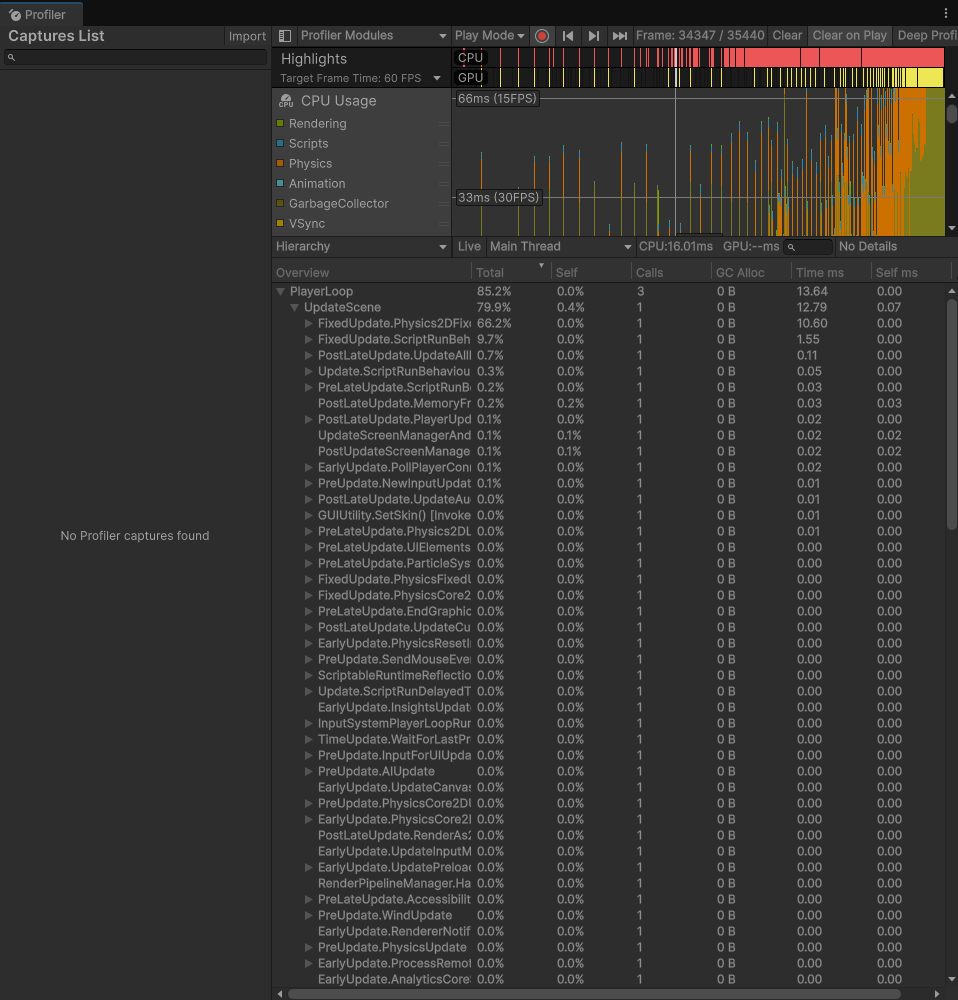
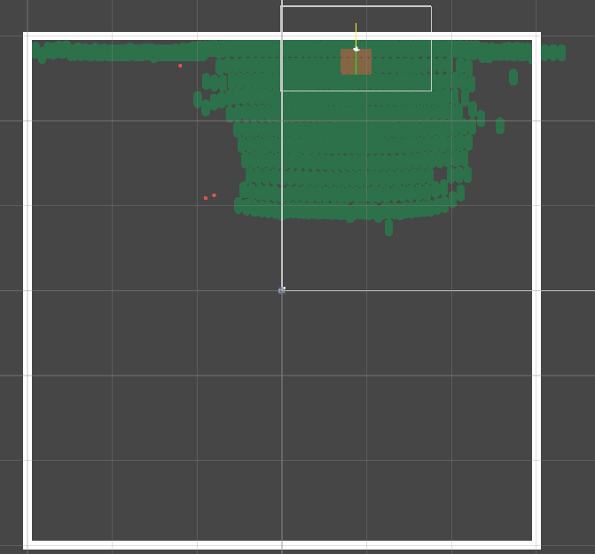
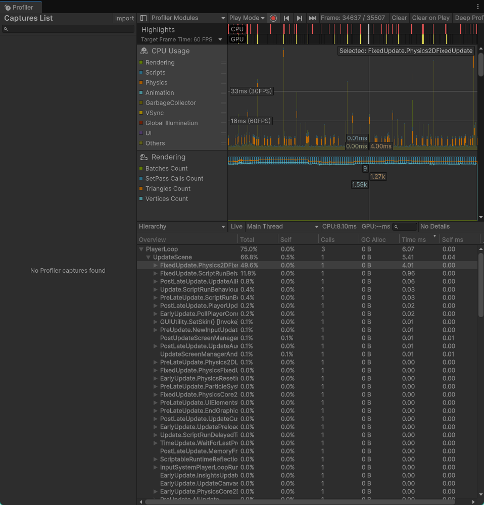

<div align="center">

# 2D Survivor — 좀비 서바이버

**5분간 좀비 도시에서 살아남는 탑다운 서바이버**

[](https://unity.com/)
[](https://docs.unity3d.com/Packages/com.unity.render-pipelines.universal@latest)
[](docs/decisions)

[](https://bbie-6772.github.io/2d-survivor/)



</div>

---

## 이 프로젝트는 무엇인가

**AI에게 코드를 받지 않고 Unity를 학습하기 위한 프로젝트**

이전 프로젝트에서는 AI가 기획서를 쓰고 AI가 구현했습니다.  
그래서 완성된 뒤에
*제가 쓰지도 않은 명세서로 만들어진, 제가 쓰지도 않은 코드*를 거꾸로 공부해야 했습니다.

이번엔 순서를 바꿨습니다.

```
기존:  아이디어 → AI가 spec → AI가 구현 → 내가 디버깅
이번:  아이디어 → 내가 spec → AI가 반박 → 내가 구현
```

AI의 역할을 둘로 나눴습니다. 설계를 돕는 **기획 AI**, 그리고 **완성 코드를 절대 주지 않고
힌트·역질문·검증 실험만 제공하는 멘토 AI**입니다. 후자는 프롬프트 부탁이 아니라
별도 모드로 규칙을 박아뒀습니다. 제가 시도한 결과를 보고해야만 한 단계 더 알려주는 방식입니다.

그 결과 **모든 코드는 직접 작성했고**, 판단의 근거는 [`docs/decisions/`](docs/decisions)에
32건(26.09.06)의 문서로 남았습니다.

📝 작업 기록: [삐에로의 지식창고 — 유니티 학습 프로젝트](https://bbie-6772.github.io/unity-project/2026/08/27/unity-project.html)

---

## 🎮 어떻게 플레이하나요

| 조작 | 키 |
|---|---|
| 이동 | `WASD` |
| 대시 | `Space` |
| 공격 방향 | `방향키` (공격은 자동) |
| 성장 선택 | `마우스 클릭` |

좀비를 처치하면 **심장**을 떨어뜨립니다. 자동으로 주워지고,  
일정량이 모이면
능력을 강화할 **세포**를 선택할 수 있어요.

<div align="center">


<sub>3장 중 1장 선택 — 근섬유 강화 · 팔 연장 · 강화 세포 · 민첩 세포 · 신경 가속 · 면역 세포</sub>
</div>

**승리** 5분 생존 · **패배** 체력 0

<div align="center">

</div>

---

## 🛠 구현 범위

`spec.md`에 설계한 것 중 일부는 마감 전에 잘라냈습니다.
**무엇을 왜 잘랐는지도 기록으로 남겼습니다**  
→ [0017. 마감 전 주말 작업 범위를 재조정한다](docs/decisions/0017-weekend-scope-cut.md)

| | 항목 |
|---|---|
| **구현** | 이동·대시, 방향 조준 근접 공격, 좀비 스폰(웨이브 테이블), 접촉 데미지, 심장 드랍 → 경험치 → 레벨업 카드 3택, 타이머·승패·재시작, HUD(체력·쿨다운·남은 시간) |
| **보류** | 보스(중간/최종), 무기 교체(샷건·스나이퍼), 대시 무적, FSM 리팩토링, 애니메이션 |

보스를 제외했으므로 승리 조건은 "최종보스 격파"에서 **"5분 생존"으로 잠정 처리**했습니다.  
보스 구현 시 원래 조건으로 되돌립니다.

---

## 📐 설계 원칙

혼자 하는 프로젝트지만 협업을 전제로 규칙을 먼저 고정했습니다 → [`docs/conventions.md`](docs/conventions.md)

**단방향 참조.** UI는 게임 로직을 참조하지만, 로직은 UI를 모릅니다.

```
EnemyDeath ──콜백──▶ EnemySpawner ──이벤트──▶ CountZombieText
 (스포너를 모름)        (구독자를 모름)
```

**이벤트는 사건과 상태로 나눈다.**  

`OnDamaged`(사건)는 피격 연출이, `OnHealthChanged`(상태)는
체력바가 구독합니다.  
최대체력 증가는 피해가 아니므로 후자만 발화합니다 →
[0028](docs/decisions/0028-status-ui-events.md)

**갱신 방식은 변화 빈도로 정한다.**

| 대상 | 변화 빈도 | 방식 |
|---|---|---|
| 체력 | 피격·업그레이드 시에만 | 이벤트 |
| 대시 쿨타임 | 매 `FixedUpdate` | 프로퍼티 폴링 |
| 남은 시간 | 매 프레임 | 폴링 + 정수 초 캐시 비교 |

---

## 📊 성능: 가설 세 개를 전부 기각한 기록

`plan.md`의 기술 축 3은 **오브젝트 풀링 + GC 제거, Profiler before/after**였습니다.
"숫자로 남는 유일한 축"이라 마지막까지 지킬 항목으로 잡아뒀습니다.

**측정 결과 이 계획은 현재의 구현상황에선 폐기됐습니다.** 그 과정이 이 프로젝트의 핵심 기록입니다.  
→ [0030. 성능 측정 조건](docs/decisions/0030-test-setting.md) · [0031. 풀링 효과 측정](docs/decisions/0031-test02-setting.md)

### ① 병목은 GC가 아니라 물리였다

무적·무조작 상태로 좀비를 누적시켜 한계점을 탐색했습니다.

<div align="center">


<sub>좀비 2132마리 — CPU 16.01ms 중 <b><code>Physics2DFixedUpdate</code>가 10.60ms (66.2%)</b>, GC Alloc은 <b>0 B</b></sub>
</div>

프레임 타임의 3분의 2가 2D 물리였고, **GC Alloc은 전 구간 0 B**였습니다.
풀링이 겨냥하는 비용이 측정에 나타나지 않았습니다.

### ② 변수는 마리 수가 아니라 밀집도였다

`AliveCount`를 함께 기록해 임계점을 찾았습니다.

| AliveCount | CPU | 상태 |
|---|---|---|
| 682 | 2.32ms | 흩어져 있음 |
| **753** | **11.41ms** | **뭉치기 시작** |
| 833 | 11.63ms | 덩어리 |

100마리가 늘었는데 프레임 타임이 5배가 됐습니다. 선형이 아닙니다.

<div align="center">


<sub>좀비가 플레이어를 향해 반원형으로 정체 — 뒷줄은 도달하지 못하면서 접촉 해소 비용만 발생시킵니다</sub>
</div>

→ **동시 스폰 상한(600)** 도입. 값의 근거는 위 실측 곡선입니다.

<div align="center">


<sub>동시 스폰 상한 600이 찬 상태 — CPU 8.10ms, <code>Physics2DFixedUpdate</code> 4.01ms (49.6%)</sub>
</div>

상한이 걸린 **최악의 경우**에도 CPU 8.10ms (에디터 오버헤드 포함, PlayerLoop 6.07ms)로, 60fps 예산(16.6ms) 안에 들어옵니다.
상한 없이 같은 시간까지 누적했을 때가 16.01ms였으므로 **약 2배 개선**입니다.
물리는 여전히 비용의 절반을 차지하지만, 마리 수가 제한되어 임계(682) 아래로 유지됩니다.

### ③ 왕복률을 올려도 GC는 나타나지 않았다

풀링이 겨냥하는 것은 동시 존재 수가 아니라 `Instantiate`/`Destroy` **왕복 횟수**이므로,
수명 1초짜리 임시 컴포넌트로 왕복만 발생시키는 조건을 따로 만들었습니다.

| 조건 | GC Alloc |
|---|---|
| 초당 왕복 20회 | 464 B |
| 초당 왕복 40 / 80 / 160회 | 464 B (변화 없음) |
| **좀비 0마리 (스포너 정지)** | **464 B** |
| 초당 왕복 2000회 | 70 B |

왕복률과 무관하게 값이 고정이라 추적한 결과, 464 B의 정체는
`UnitySynchronizationContext.ExecuteTasks` — **에디터 환경의 배경 할당**이었습니다.
좀비 왕복이 만드는 GC Alloc은 이 노이즈에 묻힐 만큼 작았습니다.

### 결론

| 가설 | 결과 |
|---|---|
| 풀링으로 GC 부담을 줄일 수 있다 | **기각** — 왕복 2000회/초에서도 GC 미발생 |
| 왕복률을 올리면 효과가 드러난다 | **기각** — 464 B는 배경 노이즈 |
| 극단값이면 보인다 | **기각** — 대신 다른 병목(Physics2D)이 드러남 |

실제 플레이 부하는 **30~65마리**로 임계(682)의 10% 미만입니다.
따라서 **현 규모에서 오브젝트 풀링을 도입할 성능적 근거는 없다**고 판단하고,
축 3을 "최적화 구현"에서 **"성능 검증"**으로 재정의했습니다.

> 최적화를 하는 것보다, 최적화가 필요 없다는 것을 데이터로 증명하는 쪽이 어려웠습니다.

---

## 📁 구조

```
Assets/_Project/Scripts/
├── Core/      # GameTimer, Health, SpawnerBase, WaveDirector, IDamageable
├── Player/    # PlayerMovement, PlayerAim, PlayerHitReceiver
├── Enemy/     # EnemySpawner, EnemyChase, EnemyDeath
├── Weapon/    # MeleeWeapon, AttackFlash
├── Growth/    # PlayerExperience, CardSelector, PlayerUpgradeApplier, Heart
├── Data/      # StatType, UpgradeCard, WaveTable (ScriptableObject 정의)
└── UI/        # HealthBar, DashCooldownBar, GameRemainingText, ~Screen

docs/
├── spec.md          # 기획서 (직접 작성)
├── plan.md          # 증명할 기술 축
├── conventions.md   # 네이밍·폴더·Git·Unity 관례
└── decisions/       # 설계 판단 기록 32건
```

- `Managers/`, `Interfaces/` 같은 **타입별 폴더를 쓰지 않습니다.** 관련 코드가 흩어지기 때문입니다.
- `GameManager.cs` 같은 이름을 만들지 않습니다. **파일 이름만 보고 책임을 한 문장으로
  말할 수 없으면 잘못된 이름**이라는 규칙을 적용했습니다.

---

## 🔧 실행

```bash
git clone https://github.com/bbie-6772/2d-survivor.git
```

Unity **6000.5.5f1** 이상으로 열고 `Assets/_Project/Scenes/MainScene`을 실행합니다.

---

<div align="center">
<sub>
작성자 <a href="https://github.com/bbie-6772">bbie-6772</a> ·
블로그 <a href="https://bbie-6772.github.io">삐에로의 지식창고</a>
</sub>
</div>
